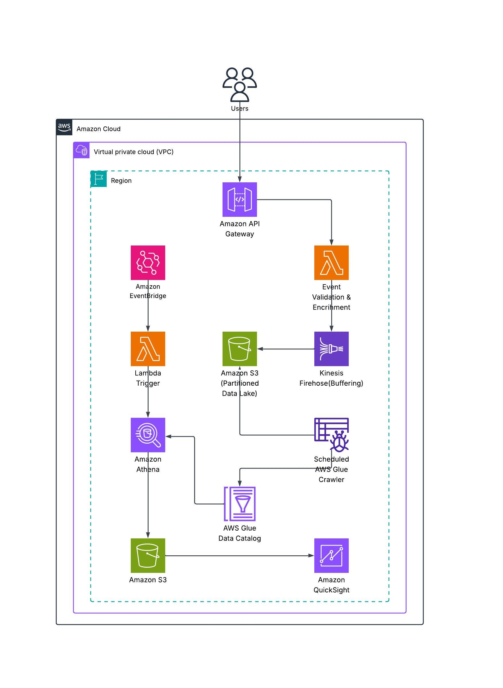

# 📊 StartSmart – Serverless User Activity Analytics Platform
## Overview

**StartSmart** is a modular, scalable, and cloud-native event processing pipeline built entirely on AWS. It ingests raw event data through AWS Lambda and delivers it into a partitioned S3-based data lake using Amazon Kinesis Firehose, with support for real-time querying via AWS Athena.
- **Supports real-time and historical queries**
- **Strictly serverless – no EC2, ECS, or containers**

## 🚀 Features

- **Real-time Event Ingestion**: Events sent through Lambda directly into Firehose.

- **Dynamic Partitioning**: Firehose writes to S3 with partitioning based on year, month, and day fields extracted from the event JSON.

- **Schema Discovery**: AWS Glue crawler scans and updates the schema automatically.

- **Athena Queries**: SQL-based access to S3 data with support for partitions and visualisation using QuickSight.

- **Secure IAM Roles**: Granular policies for least-privilege access.


---


## Architecture (MVP)



## 🛠 Tech Stack

* **Terraform** – Infrastructure as Code
* **AWS Lambda** – Event ingestion, Athena querying
* **AWS Kinesis Firehose** – Streaming delivery to S3
* **Amazon S3** – Storage for raw and partitioned events
* **AWS EventBridge** - Scheduled triggers for glue crawler 
* **AWS Glue Crawler** – Metadata extraction and table creation
* **Amazon Athena** – Query engine for the S3 data lake
* **IAM** – Secure role-based access control
* **CloudWatch** – Monitoring and logs


---


## 📥 Sample Event Payload

```json
{
  "title": "Test purchase",
  "description": "Triggered event type: purchase",
  "endTime": "2025-07-30T20:06:21.596Z",
  "startTime": "2025-07-30T19:06:21.596Z",
}
```

## How It Works
1. A frontend sends an event via an API call.
2. The Lambda ingests the payload and sends it to Firehose.
3. Firehose extracts the date and stores it in S3 under a partitioned path.
4. Glue Crawler runs (scheduled by EventBridge) and updates the Athena table.
5. Scheduled Athena queries can now be run or visualized via QuickSight.


---

## Requirements
* AWS Credentials with valid permissions to deploy infrastructure.
* [HashiCorp Terraform](https://developer.hashicorp.com/terraform/tutorials/aws-get-started/install-cli) installed.


## Setup Instructions
1. **Clone** the repository
2. **Navigate** to `terraform/`
3. **Rename** the file `example_terraform.tfvars` to `terraform.tfvars` and provide values for required variables such as region, bucket name, and Athena settings. 
4. **(Optional)** Modify the *"query"* variable in `./src/athena/lambda.py` to your use-case, then make sure to run `terraform apply` again.
5. **Run** the following one after another:
```bash
terraform init # Setups the backend for terraform
```
```bash
terraform plan # Lists out resources to be provisioned
```
```bash
terraform apply # Provisions the resources in your aws account
```

### Congratulations🎉
You have now successfully deployed your infrastructure.
You can now create insightful dashboards in QuickSight based on your Athena query results.

---

## 🛠️ Future Improvements

* Optimise Glue Crawler Recrawl policy to reduce cost.

## 🤝 Contributing
Contributions, issues, and feature requests are welcome! Feel free to open a PR or submit an issue.

## 🧾 License
This project is licensed under the MIT License. See [LICENSE](./LICENSE) for more information.

## 📬 Contact

Built with ❤️ by Ofor David Tochukwu
*Open to feedback and collaboration.*
*My Email: [davidoforincloud@gmail.com](mailto:davidoforincloud@gmail.com)*

